# Architecture — Support Activity Tracker

> Visual reference for the system architecture using Mermaid diagrams.
> All diagrams render natively in GitHub, VS Code, and most modern Markdown viewers.

---

## 1. Entity-Relationship Diagram (ERD)

Relationships between the four main database tables. `activity_logs` is an append-only event store;
`audit_logs` is the polymorphic security/compliance log.

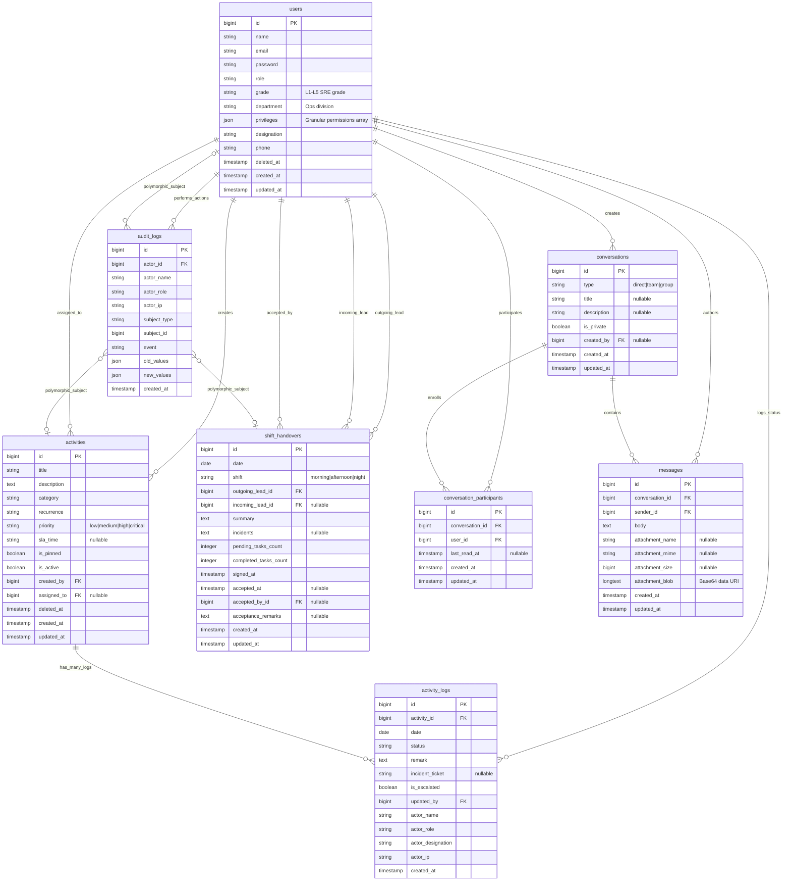

---

## 2. 4-Tier Application Architecture

The system is engineered using an enterprise **4-Tier Architecture** pattern to isolate UI presentation, HTTP control flow, core business execution, and database persistence.

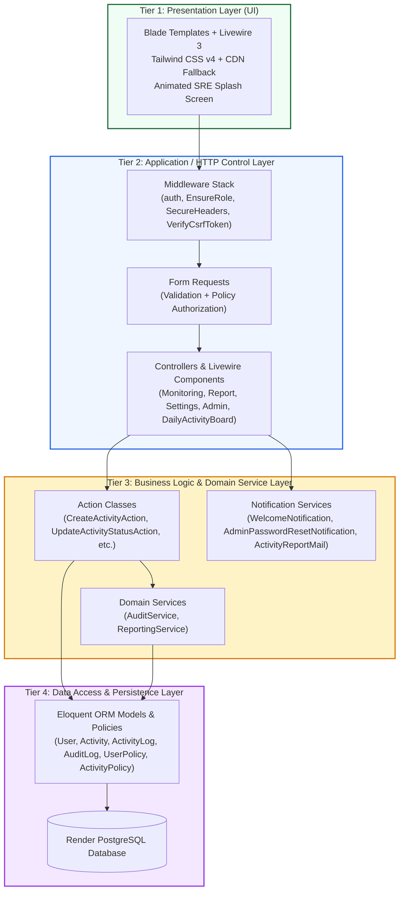

### 4-Tier Breakdown & Key Responsibilities

| Tier | Component | Responsibility |
|---|---|---|
| **Tier 1: Presentation** | Blade, Livewire, Tailwind | Renders rich responsive dashboards, splash screens, real-time polling UI, and PDF report layouts. |
| **Tier 2: Application / HTTP** | Middleware, FormRequests, Controllers | Guards routes (RBAC), validates incoming payloads, handles session auth, and delegates requests. |
| **Tier 3: Business & Services** | Actions, Services, Mail/Notifications | Contains single-responsibility business logic, audit trail recording, reporting algorithms, and automated email dispatches. |
| **Tier 4: Data Persistence** | Eloquent Models, Policies, PostgreSQL | Handles ORM relationships, soft-delete scopes, polymorphic morphs, schema migrations, and database queries. |

---

## 3. Request Lifecycle — Status Update Flow

Detailed sequence of what happens when an operator marks an activity as Done.

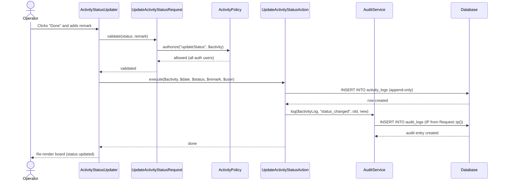

---

## 4. Role-Based Access Control (RBAC) Map

Which roles can access which routes and perform which actions.

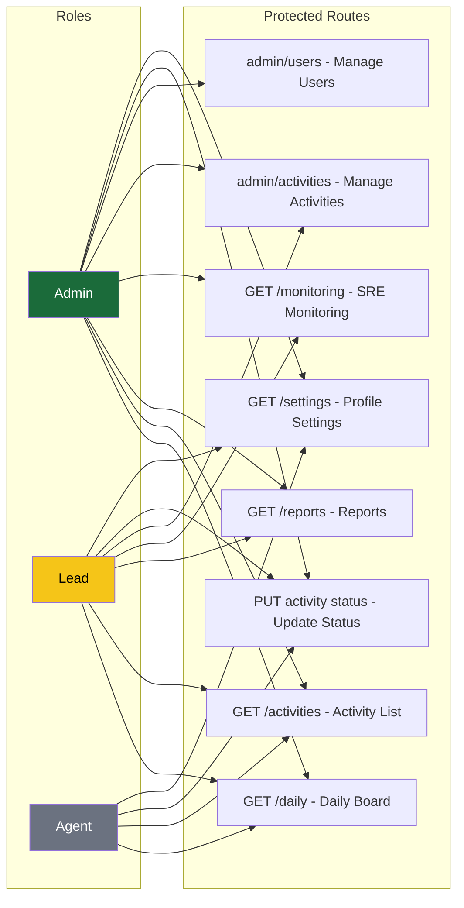

---

## 5. Data Flow — Report Generation

How a date-range report is built, rendered, printed and emailed.

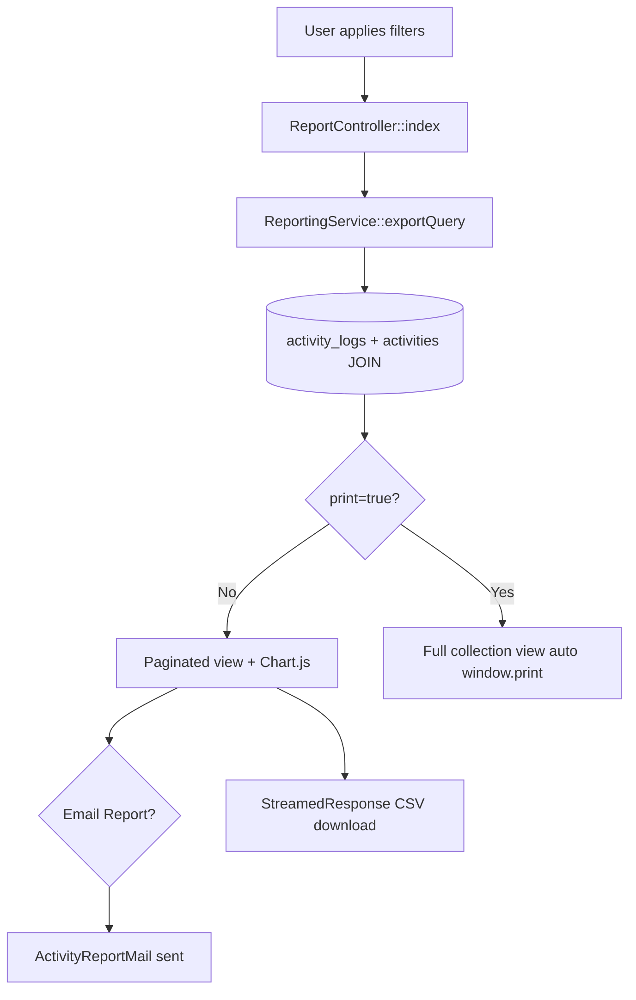

---

## 6. Module Dependency Graph

Shows which application modules depend on which other modules.

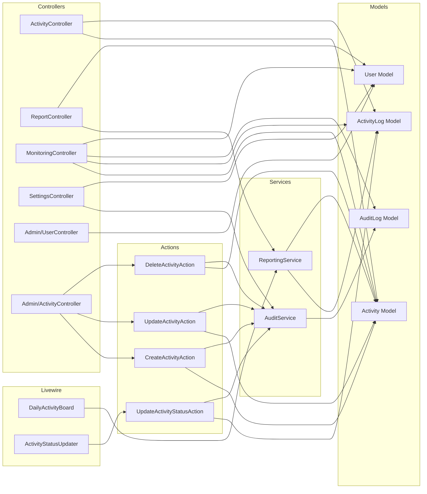

---

## 7. Deployment Architecture (Render.com + Docker)

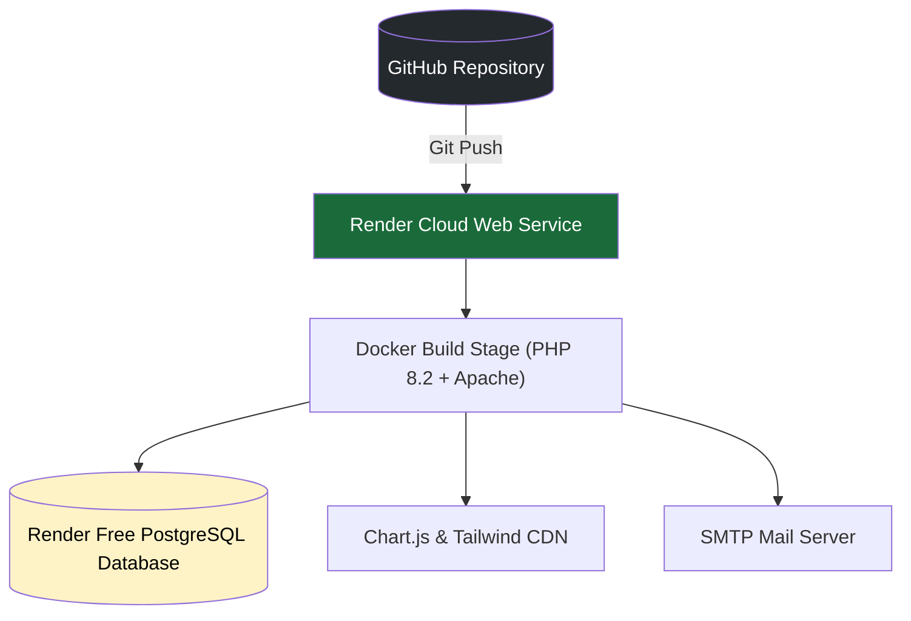

---

## 8. Security Enforcement Chain

Every request passes through multiple security checkpoints.

```mermaid
flowchart LR
    Req["HTTP Request"]
    CORS["HandleCors"]
    CSRF["VerifyCsrfToken"]
    Auth["Authenticate (auth)"]
    Role["EnsureRole (admin, lead)"]
    Policy["Laravel Policy"]
    Ctrl["Controller / Action"]
    Audit["AuditService"]

    Req --> CORS
    CORS --> CSRF
    CSRF --> Auth
    Auth --> Role
    Role --> Policy
    Policy --> Ctrl
    Ctrl --> Audit

    style Auth fill:#2563eb,color:#fff
    style Role fill:#F5C518,color:#000
    style Policy fill:#9333ea,color:#fff
    style Audit fill:#1B6B3A,color:#fff
```

---

---

## 9. Task Assignment & Delegation Architecture

Allows Team Leads and Administrators to optionally delegate operational checks to specific engineers while maintaining a general shift pool for unassigned tasks.

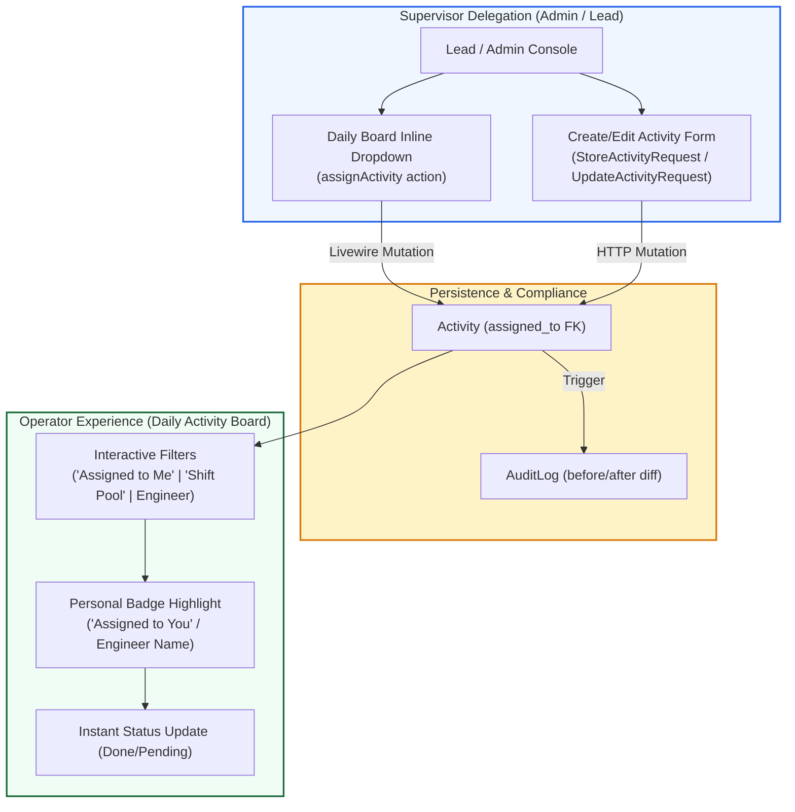

---

---

## 10. SRE Operational Continuity & Shift Handover Architecture

Formalizes shift transitions across 24/7 SRE teams (Morning, Afternoon, Night) with SLA tracking, incident ticket linkage, and supervisor batch delegation.

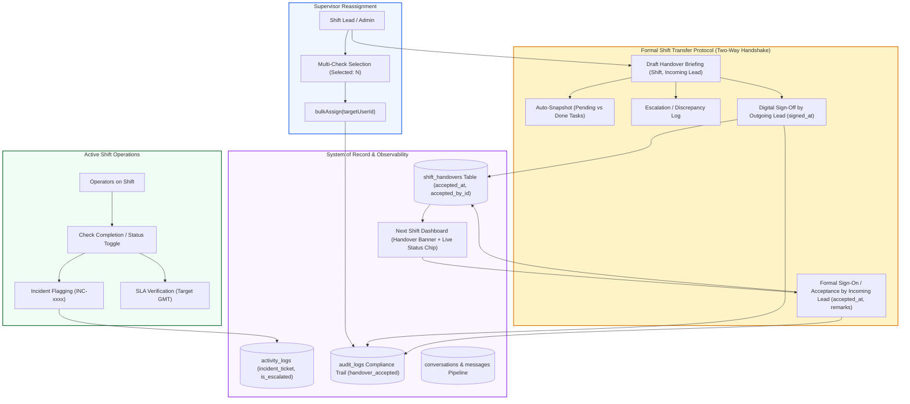

---

## 8. SRE Operational Communications Architecture

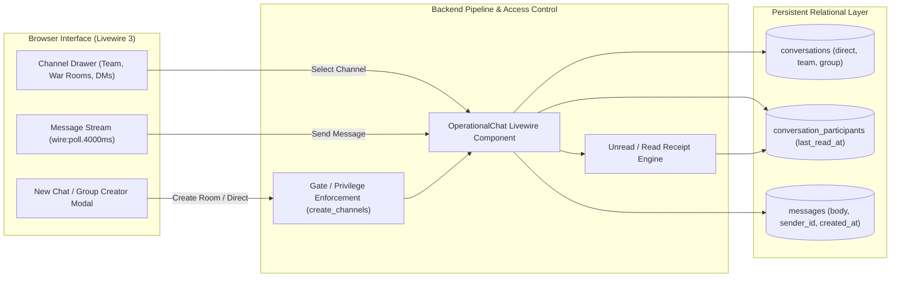

---

## 9. Real-Time SRE System Health & Telemetry Subsystem

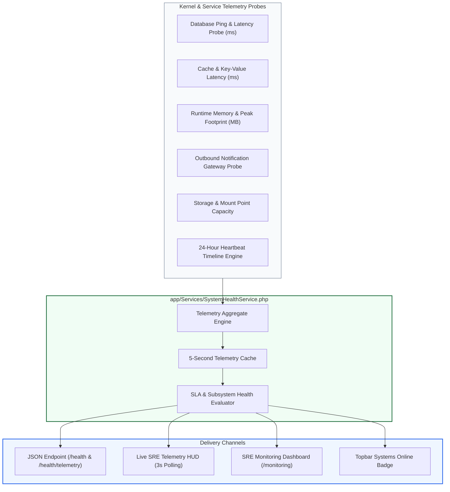

---

## 10. Left Sidebar Global Navigation & UI Layout Architecture

```mermaid
flowchart LR
    subgraph Shell["Global App Shell (resources/views/layouts/app.blade.php)"]
        direction TB
        BRAND["Npontu Brand Header (Gold Triangle Motif)"]
        STATUS["SRE Cockpit Banner (Live Radar Pulse)"]
        NAV["Grouped Sidebar Nav (resources/views/layouts/sidebar-nav.blade.php)"]
        PROFILE["User Profile Card (Initials Avatar, Grade, Settings, Sign Out)"]
    end

    subgraph Content["Right-Side Main Stage"]
        direction TB
        CONTEXT["Context Bar (Back, Breadcrumbs, UTC Clock, Systems Online Badge)"]
        ALERTS["Flash Messages (x-alert)"]
        STAGE["Main Viewport (Blade @yield('content') + Livewire $slot)"]
        FOOTER["SRE SLA Footer (no-print)"]
    end

    Shell --- Content

    style Shell fill:#0F1A14,stroke:#1A2E22,stroke-width:2px,color:#ffffff
    style Content fill:#F4F7F5,stroke:#cbd5e1,stroke-width:2px
```

---

## 11. SRE Branded Error Handling & Session Expiry Lifecycle

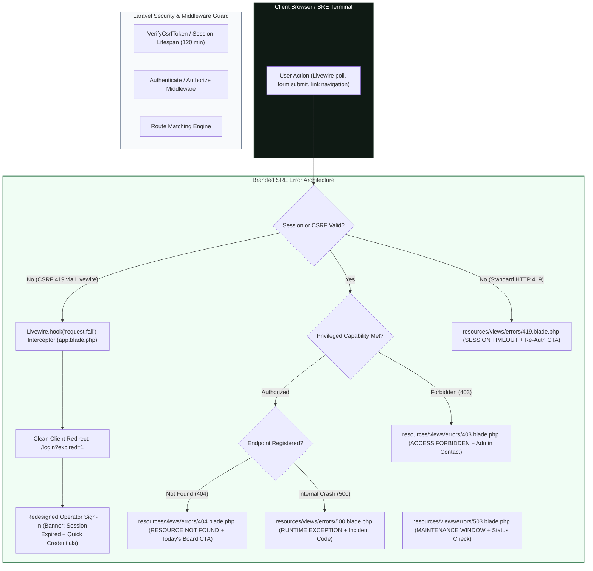

---

## 12. Public SRE Landing Page & Route Gateway Architecture

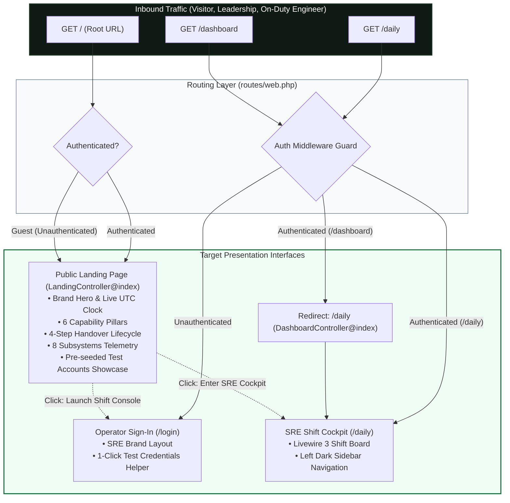

---

## 13. Multi-Client SRE Platform Architecture (Flutter Mobile + Laravel 11)

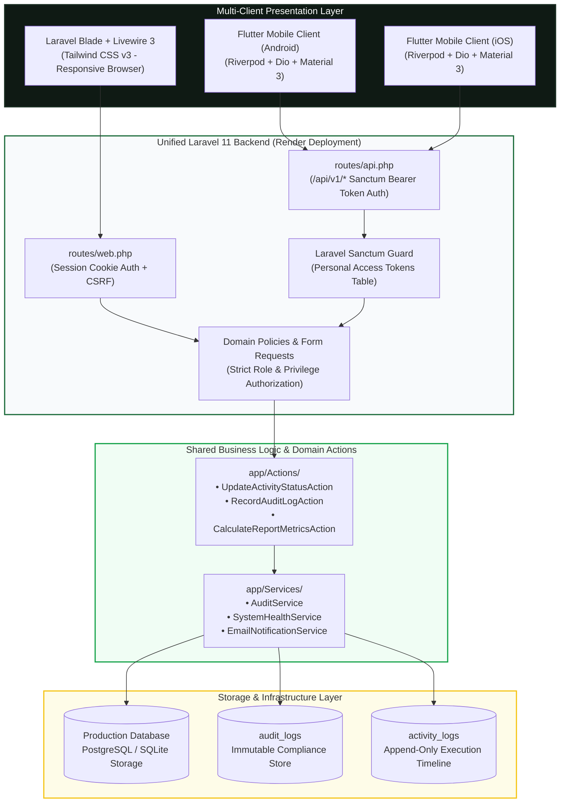

---

## 14. Mobile Sanctum Token Lifecycle & Secure Storage Architecture

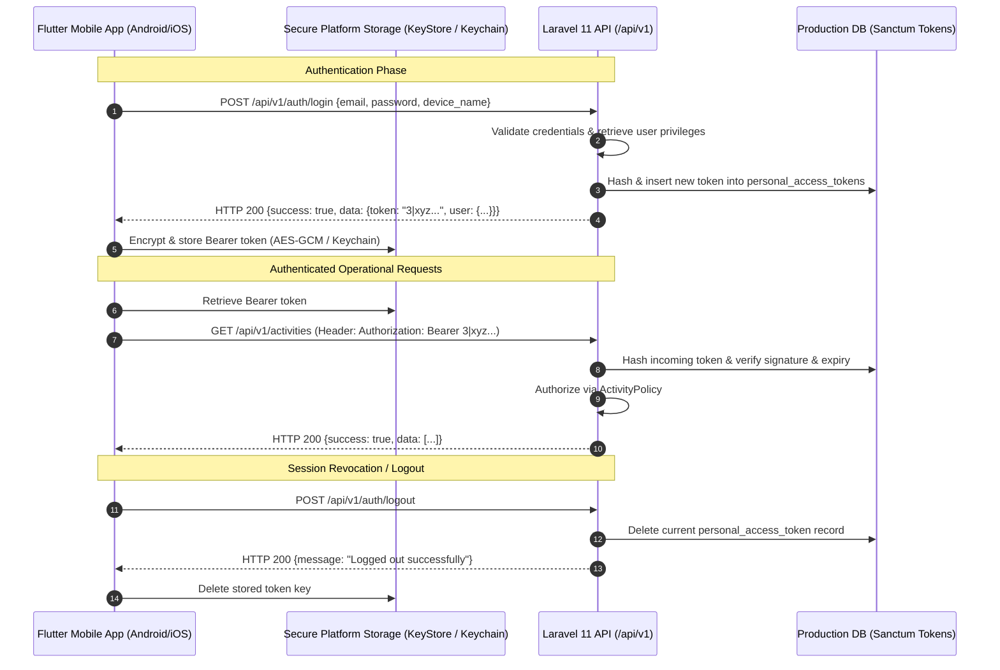

---

## Architecture Decisions Log

| # | Decision | Chosen | Rejected | Rationale |
|---|---|---|---|---|
| 1 | Frontend reactivity | Livewire 3 | Inertia/React | No JS build pipeline; wire:poll handles live updates; PHP-only codebase |
| 2 | Status storage | Append-only `activity_logs` | Mutable status column | Preserves full timeline for shift handover and audit |
| 3 | Audit logging | Separate `audit_logs` table | Embedding in `activity_logs` | Different consumers: domain log vs security/SIEM log |
| 4 | Actor identity | Server-captured from Auth session | Client-submitted | Prevents bio spoofing |
| 5 | Soft deletes | `SoftDeletes` on Activity + User | Hard delete | Historical logs must not break when records are removed |
| 6 | Role system | String column + Policy | Spatie Permissions | YAGNI — 3 roles, fixed boundaries; no permission matrix needed |
| 7 | Monitoring access | Admin + Lead only | All users | Audit trails contain sensitive IP and change data |
| 8 | Database (production) | Render PostgreSQL / SQLite disk | MySQL SaaS | High durability, relational integrity, zero external vendor bill |
| 9 | Task Delegation | Optional Nullable FK (`users.id`) | Separate Team/Assignment Pivot | Preserves shift pool elasticity while giving 1-click personal accountability |
| 10 | Incident Escalation | Denormalized on `activity_logs` | External Ticketing Webhook Only | Connects shift checkoff discrepancies directly to incident ticket references |
| 11 | Digital Shift Handover | Dedicated `shift_handovers` table | Unstructured remarks or chat apps | Enforces formal briefing sign-off between outgoing and incoming shift leads |
| 12 | Two-Way Handover Handshake | Sign-off + Sign-on Acceptance | Outgoing sign-off only | Eliminates ambiguity in operational custody between shifts |
| 13 | Operational Messaging Pipeline | First-party Relational Comms + Livewire polling | Slack/Discord webhook dependency | Self-contained, zero-cost, compliant within SRE security boundary |
| 14 | SRE User Grades & Granular Privileges | 5-tier Grades (L1-L5) + Checkbox Privileges JSON | Rigid single-role inheritance | Allows fine-grained operational permissions across seniority |
| 15 | Multi-Service Telemetry Probes | `SystemHealthService` with 8 probes + HUD | Third-party APM SaaS agent | Zero-overhead native SRE diagnostics with public JSON probe endpoint |
| 16 | Left Sidebar Navigation Architecture | Sticky Left Dark Cockpit + Responsive Drawer | Crowded 64px Horizontal Navbar | Reclaims vertical breathing room, isolates background polling |
| 17 | Branded SRE Error Pages & 419 Interceptor | Custom SRE Error Views + Livewire 419 Redirect Hook | Default stark Laravel error pages | Prevents jarring user disconnect during session expiration |
| 18 | Public SRE Landing Page at Root (`/`) | High-Impact SRE Landing View with Test Roles Showcase | Immediate blank redirect to `/login` | Educates external evaluators and leadership on platform capabilities |
| 19 | Cross-Platform Mobile Client | Flutter 3.24+ (Dart) with Riverpod + Dio | React Native / Progressive Web App | Single high-performance codebase for iOS and Android, native KeyStore/Keychain security |
| 20 | Mobile Authentication Protocol | Laravel Sanctum Personal Access Tokens | JWT / OAuth2 Passport | Native Laravel ecosystem alignment, simple revocation, token hash in DB |
| 21 | Production Cloud Deployment | Render Web Service (`https://opsora-sre.onrender.com`) | Self-hosted VPS | Automated Git-backed continuous deployments with managed PostgreSQL and Docker |

