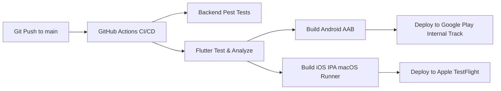

# Mobile Store Publishing Guide: Google Play Store & Apple App Store

> **Platform**: Npontu Technologies SRE Operations Mobile (`npontu_sre_mobile`)  
> **Backend Deployment**: [https://opsora-sre.onrender.com](https://opsora-sre.onrender.com)  
> **API Version**: `v1` (`https://opsora-sre.onrender.com/api/v1`)  
> **Application ID / Bundle ID**: `com.npontu.sre.npontuSreMobile`

---

## Part 1: Google Play Store Publishing (Android)

### 1.1 Prerequisites
1. **Google Play Developer Account**: Registered at [play.google.com/console](https://play.google.com/console) ($25 one-time registration fee).
2. **Organization / Individual Verification**: Complete identity verification and D-U-N-S number validation (for organizational accounts).
3. **Java Development Kit (JDK 17+)**: Required for `keytool` keystore generation.

---

### 1.2 Generate Release Signing KeyStore

Run the following command on your terminal (keep this keystore file secure and never commit it to source control):

```bash
# Generate release keystore
keytool -genkey -v -keystore npontu-sre-release.jks -keyalg RSA -keysize 2048 -validity 10000 -alias npontu-sre-key
```

Prompt entries:
- **Keystore Password**: Choose a strong password.
- **First and Last Name**: John Okyere (or Npontu Technologies DevSecOps Team).
- **Organizational Unit**: Site Reliability Engineering.
- **Organization**: Npontu Technologies.
- **City / Locality**: Accra.
- **Country Code**: GH.

Store the file at:
`npontu_sre_mobile/android/app/npontu-sre-release.jks` (automatically excluded by `.gitignore`).

---

### 1.3 Configure Android Signing Properties

Create `npontu_sre_mobile/android/key.properties`:

```properties
storePassword=your_keystore_password
keyPassword=your_key_password
keyAlias=npontu-sre-key
storeFile=npontu-sre-release.jks
```

Verify `npontu_sre_mobile/android/app/build.gradle` has the signing configuration:

```groovy
def keystoreProperties = new Properties()
def keystorePropertiesFile = rootProject.file('key.properties')
if (keystorePropertiesFile.exists()) {
    keystoreProperties.load(new FileInputStream(keystorePropertiesFile))
}

android {
    ...
    signingConfigs {
        release {
            keyAlias = keystoreProperties['keyAlias']
            keyPassword = keystoreProperties['keyPassword']
            storeFile = keystoreProperties['storeFile'] ? file(keystoreProperties['storeFile']) : null
            storePassword = keystoreProperties['storePassword']
        }
    }
    buildTypes {
        release {
            signingConfig = signingConfigs.release
            minifyEnabled = true
            shrinkResources = true
            proguardFiles getDefaultProguardFile('proguard-android-optimize.txt'), 'proguard-rules.pro'
        }
    }
}
```

---

### 1.4 Build the Production Android App Bundle (.aab)

Google Play requires the **Android App Bundle (.aab)** format for all new applications:

```bash
cd npontu_sre_mobile

# Clean build directory
flutter clean
flutter pub get

# Build Release App Bundle pointing to live Render production backend
flutter build appbundle --release --dart-define=API_BASE_URL=https://opsora-sre.onrender.com/api/v1
```

The output bundle will be generated at:
`build/app/outputs/bundle/release/app-release.aab`

*(For local device testing via USB or side-loading, build the `.apk`: `flutter build apk --release`)*.

---

### 1.5 Google Play Console Submission Steps

1. **Create New App**:
   - Go to [Google Play Console](https://play.google.com/console) &rarr; **All apps** &rarr; **Create app**.
   - **App name**: `Npontu SRE Operations`
   - **Default language**: English (United States) - `en-US`
   - **App or game**: App
   - **Free or paid**: Free
2. **App Content Declarations**:
   - **Privacy Policy**: `https://opsora-sre.onrender.com/privacy-policy`
   - **App Access**: Select "All or some functionality is restricted". Provide credentials for a dedicated reviewer account provisioned from your workspace admin console:
     - *Username*: `[Reviewer Account Email]`
     - *Password*: `[Reviewer Secure Password]`
     - *Instructions*: "Enterprise login credentials for SRE on-call mobile review and inspection."
   - **Ads**: Select "No, my app does not contain ads".
   - **Content Rating**: Complete the IARC questionnaire (Utility / Productivity app &rarr; Rating: Everyone / PEGI 3).
   - **Target Audience**: 18 and older (Enterprise work tool).
   - **Data Safety**:
     - Data collected: User Account Info (Email, User ID), Performance & Crash Diagnostics.
     - Encrypted in transit: **Yes (HTTPS/TLS 1.3)**.
     - Can users request data deletion: **Yes (via Administrator Console)**.
3. **Store Listing Assets**:
   - **Short description** (max 80 chars):  
     `Enterprise Site Reliability Engineering operations, shift handovers & telemetry.`
   - **Full description** (max 4000 chars):  
     `Official mobile client for the Npontu Technologies SRE Operations Platform. Designed for on-duty site reliability engineers, field support leads, and operations management to monitor live production systems, execute daily shift checkoff lists, conduct formal two-way shift handovers with non-repudiation, collaborate in real-time incident war rooms, and review live infrastructure telemetry probes.`
   - **App Icon**: 512 x 512 px 32-bit PNG (with alpha).
   - **Feature Graphic**: 1024 x 500 px JPEG or 24-bit PNG.
   - **Phone Screenshots**: Minimum 2 screenshots, 1080 x 2400 px or 1080 x 1920 px (Dashboard, Activities Board, Handover Flow, Comms).
4. **Release Track Rollout**:
   - Navigate to **Testing** &rarr; **Internal testing** &rarr; **Create new release**.
   - Upload `app-release.aab`.
   - Release name: `1.0.0 (Build 1)`
   - Release notes: `Initial production release of Npontu SRE Operations platform client.`
   - Save and review release &rarr; Roll out to internal testers.
   - Promote to **Closed testing** or **Production** once validated.

---

## Part 2: Apple App Store Publishing (iOS)

### 2.1 Prerequisites
1. **Apple Developer Program Account**: Enrolled at [developer.apple.com](https://developer.apple.com) ($99/year).
2. **macOS Hardware**: A Mac with macOS Sonoma or Sequoia and **Xcode 15+** installed.

---

### 2.2 Register App ID and Capabilities

1. Log into [Apple Developer Portal](https://developer.apple.com/account).
2. Go to **Certificates, Identifiers & Profiles** &rarr; **Identifiers** &rarr; `+`.
3. Select **App IDs** &rarr; **App**:
   - **Description**: `Npontu SRE Operations`
   - **Bundle ID**: Explicit &rarr; `com.npontu.sre.npontuSreMobile`
   - **Capabilities**: Enable `Push Notifications` (if FCM is used), `Associated Domains` (for deep linking).
4. Create an **Apple Distribution Certificate** and **App Store Provisioning Profile** linked to `com.npontu.sre.npontuSreMobile`.

---

### 2.3 Configure Xcode Project (`ios/Runner.xcworkspace`)

Open `npontu_sre_mobile/ios/Runner.xcworkspace` in Xcode:
1. In the **Signing & Capabilities** tab:
   - Select the target `Runner`.
   - Check **Automatically manage signing**.
   - Select your **Apple Developer Team**.
   - Verify Bundle Identifier is `com.npontu.sre.npontuSreMobile`.
2. In `Info.plist`, ensure camera/photo library usage descriptions are populated for image attachments:
   ```xml
   <key>NSPhotoLibraryUsageDescription</key>
   <string>Allow access to attach error screenshots and operational logs to incident war rooms.</string>
   ```

---

### 2.4 Build and Archive Release IPA

From the macOS terminal:

```bash
cd npontu_sre_mobile

# Install CocoaPods dependencies
cd ios
pod install
cd ..

# Build release IPA targeting live Render backend
flutter build ipa --release --dart-define=API_BASE_URL=https://opsora-sre.onrender.com/api/v1
```

The output archive is created at:
`build/ios/archive/Runner.xcarchive` and `build/ios/ipa/npontu_sre_mobile.ipa`.

---

### 2.5 Upload to App Store Connect

#### Method A: Using Xcode Organizer (Recommended GUI)
1. Open Xcode &rarr; **Window** &rarr; **Organizer**.
2. Select the latest archive of **Runner**.
3. Click **Distribute App** &rarr; select **App Store Connect** &rarr; click **Upload**.
4. Xcode validates the archive, signs with your Distribution Certificate, and uploads to App Store Connect.

#### Method B: Using `xcrun altool` (Automated CLI)
```bash
xcrun altool --upload-app --type ios \
  -f build/ios/ipa/npontu_sre_mobile.ipa \
  -u "your-apple-id@npontu.com" \
  -p "app-specific-password"
```

---

### 2.6 App Store Connect Configuration

1. Log into [appstoreconnect.apple.com](https://appstoreconnect.apple.com) &rarr; **My Apps** &rarr; `+` **New App**.
   - **Platforms**: iOS
   - **Name**: `Opsora SRE`
   - **Primary Language**: English (U.S.)
   - **Bundle ID**: `com.npontu.sre.opsoraSreMobile`
   - **SKU**: `OP-SRE-IOS-001`
   - **User Access**: Full Access
2. **App Information & Privacy**:
   - **Category**: Business / Developer Tools
   - **Privacy Policy URL**: `https://opsora-sre.onrender.com/privacy-policy`
   - **App Privacy Declarations**:
     - *User Content*: Photos/Files (for incident logs) - linked to user, not used for tracking.
     - *Identifiers*: User ID - linked to user.
3. **App Review Information**:
   - **Sign-in Information**: Required
   - **Username**: `[EMAIL_ADDRESS]`
   - **Password**: `[PASSWORD]`
   - **Notes for Reviewer**:
     > "Opsora SRE is an enterprise site reliability engineering monitoring tool. The review credentials grant access to active shift boards, two-way handover workflows, and system telemetry probes hosted at your deployed platform URL."
4. **TestFlight Distribution**:
   - Under **TestFlight**, the uploaded build will process (5–15 minutes).
   - Add **Internal Testing Group** (leads and SRE engineers get instant access via TestFlight app).
   - Create **External Testing Group** with public link or email invites.
5. **Submit for App Review**:
   - Attach build from TestFlight.
   - Click **Submit for Review**. App Store review typically completes within 24–48 hours.

---

## Part 3: Automated CI/CD Store Deployment Pipeline

In `.github/workflows/`, GitHub Actions can automate store deployments using Fastlane:



### Fastlane Configuration Summary
- **Android**: Use `fastlane supply` with Google Cloud Service Account JSON key (`supply.json`).
- **iOS**: Use `fastlane pilot` or `deliver` with App Store Connect API Key (`AuthKey_XXXXXXXXXX.p8`).

---

## Part 4: Production URLs & Live Verification Reference

| Service | Endpoint | Status |
|---|---|---|
| **Web SRE Cockpit** | [https://opsora-sre.onrender.com](https://opsora-sre.onrender.com) | **Live & Operational** |
| **System Health API** | [https://opsora-sre.onrender.com/health](https://opsora-sre.onrender.com/health) | **HTTP 200 (Uptime SLA 99.98%)** |
| **REST API v1 Gateway** | [https://opsora-sre.onrender.com/api/v1](https://opsora-sre.onrender.com/api/v1) | **Active on Push** |
| **OpenAPI 3.0 Specs** | `docs/api/openapi.yaml` | **33 Endpoints Documented** |
| **Privacy Policy URL** | `https://opsora-sre.onrender.com/privacy-policy` | **Live & Store Compliant** |
| **Terms of Service** | `https://opsora-sre.onrender.com/terms-of-service` | **Live & Store Compliant** |
